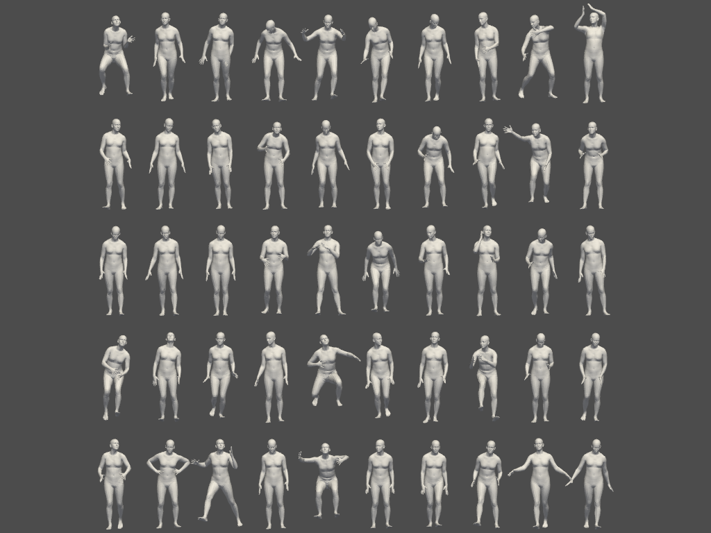
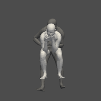
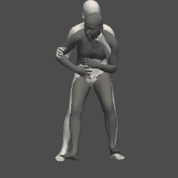
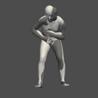

# VPoser

A simple and clean [VPoser](https://github.com/nghorbani/human_body_prior) for inference.




## Install

```bash
pip install git+https://github.com/zzilch/vposer

# or
# git clone https://github.com/zzilch/vposer && cd vposer
# python setup.py install
```

## Downloading the model

This part is same with [SMPLX](https://smpl-x.is.tuebingen.mpg.de/). Put body models and vposer models with file structure below.

```
models
├── smpl
│   ├── SMPL_FEMALE.pkl
│   └── SMPL_MALE.pkl
│   └── SMPL_NEUTRAL.pkl
├── smplh
│   ├── SMPLH_FEMALE.pkl
│   └── SMPLH_MALE.pkl
├── mano
|   ├── MANO_RIGHT.pkl
|   └── MANO_LEFT.pkl
├── smplx
|   ├── SMPLX_FEMALE.npz
|   ├── SMPLX_FEMALE.pkl
|   ├── SMPLX_MALE.npz
|   ├── SMPLX_MALE.pkl
|   ├── SMPLX_NEUTRAL.npz
|   └── SMPLX_NEUTRAL.pkl
└── vposer
    ├── vposer_v1_0      # VPoser v1.0 expr_dir
    └── V02_05          # VPoser v2.0 expr_dir
```

Install the official [VPoser](https://github.com/nghorbani/human_body_prior) to clean the models.

```
pip install git+https://github.com/nghorbani/human_body_prior
python scripts/clean_models.py
```

The you wil get the clean check points of VPoser like this
```
└── vposer
    ├── vposer_v1_0     # VPoser v1.0 expr_dir
    ├── V02_05          # VPoser v2.0 expr_dir
    ├── TR00_E096.pt    # clean model v1.0 
    ├── V02_05_epoch=08_val_loss=0.03.ckpt # clean model v2.0
    └── V02_05_epoch=13_val_loss=0.03.ckpt # clean model v2.0
```

## Usage

1. Use VPoser: The VPoser models `vposer.VPoserV1` and `vposer.VPoserV2` are borrowed from the offical released code.  Using `vp = vposer.create(path_to_checkpoint,version)` to load a VPoser model.  
2. Use body model with VPoser: Using `vposer.VPoserBodyModel(bm,vp)` and  `vposer.VPoserBodyLayer(bm,vp)` to create body model with VPoser, which `bm` is a body model from official SMPLX.

Check examples for more details

```bash
pip install pyvista
python examples/sample.py
python examples/ik.py
```

  


## Citation

Please cite the following paper if you use this code directly or indirectly in your research/projects:
```
@inproceedings{SMPL-X:2019,
  title = {Expressive Body Capture: 3D Hands, Face, and Body from a Single Image},
  author = {Pavlakos, Georgios and Choutas, Vasileios and Ghorbani, Nima and Bolkart, Timo and Osman, Ahmed A. A. and Tzionas, Dimitrios and Black, Michael J.},
  booktitle = {Proceedings IEEE Conf. on Computer Vision and Pattern Recognition (CVPR)},
  year = {2019}
}
```

## License

Software Copyright License for **non-commercial scientific research purposes**.
Please read carefully the [terms and conditions](./LICENSE) and any accompanying documentation before you download and/or use the SMPL-X/SMPLify-X model, data and software, (the "Model & Software"), including 3D meshes, blend weights, blend shapes, textures, software, scripts, and animations. By downloading and/or using the Model & Software (including downloading, cloning, installing, and any other use of this github repository), you acknowledge that you have read these terms and conditions, understand them, and agree to be bound by them. If you do not agree with these terms and conditions, you must not download and/or use the Model & Software. Any infringement of the terms of this agreement will automatically terminate your rights under this [License](./LICENSE).